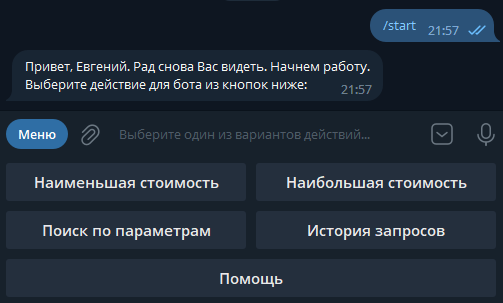
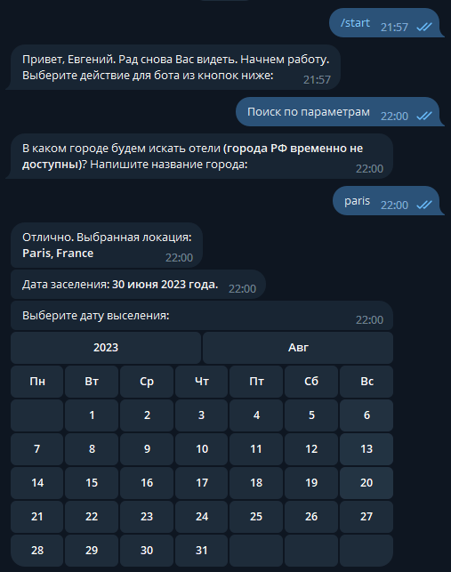
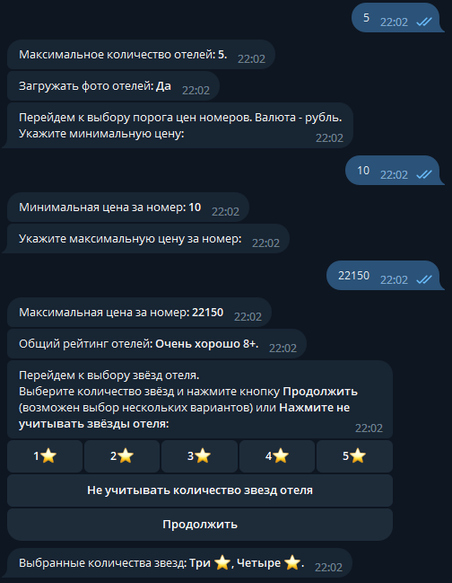

##  Telegram-bot
***       
Этот Telegram-бот предназначен для поиска отелей по всему миру (на данный помент поиск по РФ недоступен) и вывода информации о них.

Данный Telegram-бот был разработан в рамках финальной работы [курса "Основы Python"](https://skillbox.ru/course/profession-python/) от [Skillbox](https://skillbox.ru) на языке программирования Python 3.10 c использованием фреймворка aiogram 3.0.0b7.


## 1. Создание Telegram-бота
***
Для создания бота в Telegram нужно написать боту [BotFather](https://t.me/BotFather), в диалоге с ним сначало нужно отправить команду ``/newbot`` для создания нового бота. Далее нужно ввести название и имя пользователя будущего бота, после чего BotFather отправит ссылку для доступа к боту и его токен.

## 2. Работа с кодом программы
***
Для работы с кодом программы необходимо скачать все прикреплённые файлы в папку проекта.
Запускающим файлом является ``main.py``.
Первым делом нужно установить все необходимые библиотеки. Их перечень находится в файле ``requirements.txt``: 
- aiogram 3.0.0b7
- python-dotenv 1.0.0
- requests 2.28.2
- pydantic 1.10.7
- aiosqlite 0.19.                   
```
pip install -r requirements.txt
```

После установки библиотек необходимо создать файл ``.env`` по образцу ``.env.template`` (или переименовать файл ``.env.template`` в ``.env``), куда прописать ``BOT_TOKEN = ''`` полученный токен от BotFather, а также ключи для доступа к API сайтов 
``X_RAPID_API_KEY = ''`` <https://rapidapi.com/apidojo/api/hotels4> и ``CURRENCYCONVERTERAPI = ''`` <https://www.currencyconverterapi.com>.

В данном коде бота реализован доступ к бесплатному ресурсу сервера <https://www.currencyconverterapi.com>, у которого есть ограничения при использовании бесплатных ресурсов на количество запросов к нему и т.п., соответственно если Вы захотите получить доступ более высокого уровня, то необходимо будет внести изменения в код функции ``current_rate_USD`` файла ``main_request.py`` в зависимости от уровня доступа:
- если это Premium доступ, то удалить строку с переменной ``used_servers = 'free.currconv.com'`` с комментарием ``# для премиальных серверов:`` и удалить символ ``#`` с пробелом перед строкой ``# used_servers = 'api.currconv.com'``. Функция в итоге должна выглядеть так:   
``` python
def current_rate_USD() -> int:
    """ Функция выполнения API запроса на текущий курс доллара к рублю """
    key_api = config.currencyconverterapi.get_secret_value()
    used_servers = 'api.currconv.com'
    ...
``` 
- если это доступ для Предоплаченных серверов - делаем по инструкции выше, только для оставшихся строк кода (более подробно о тарифах и предоставляемых услугах можно узнать на самом сервере <https://www.currencyconverterapi.com>). Должно получится как показано ниже: 
``` python
def current_rate_USD() -> int:
    """ Функция выполнения API запроса на текущий курс доллара к рублю """
    key_api = config.currencyconverterapi.get_secret_value()
    used_servers = 'prepaid.currconv.com'
    ...
``` 

Будьте внимательны при вводе данных ключей и токена, от них напрямую зависит исправность работы бота!

## 3. Инструкция по использованию
***
Запустить программу на компьютере.
Запустите Telegram, нажмите на вкладку вашего бота, нажмите ``/start``. После этого Вам отправится приветственное сообщение от бота, после чего он запросит Ваше имя для внесения его в базу данных и отобразятся кнопки с выбором режима работы бота (эти команды доступны также в ``меню`` бота).

Если запуск бота не произошел, смотрите строку выполнения кода: если неправильно введен токен телеграм бота, об этом сразу отобразится информация: ``Ошибка авторизации телеграмм бота... ``, если причина в самом сервере телеграмма, то отобразится ``Непредвиденная ошибка не сервере Telegram...``. Здесь, скорее всего, необходимо повторить запуск спустя некоторое время.
Потестируйте бота сами. Если токен к Hotels API ввели не верно, то после первого запроса на ввод названия города в строке выполнения кода появится сообщение ``'Неверный ключ авторизации к Hotels API...``, а в чате выдаст ошибку ``Что-то пошло не так. Ошибка на сервере hotels...`` и бот вернет пользователя к начальному меню запроса поиска.

Конвертация валют рубль в доллар происходит по актуальному курсу через API запросы к серверу <https://www.currencyconverterapi.com> 
на момент запроса. Если при запросе возникнут непредвиденные ошибки, то будет использоваться курс 1 к 60. 
При этом, если эта ошибка авторизации на сервере (возможно был введен некорректно ключ доступа), то это отобразится в строке выполнения кода ``Ваш ключ к "currencyconverterapi.com" не верный...``. и необходимо будет проверить ключ в ``.env`` с полученным от сервера, 
либо запросить новый ключ доступа к API сервера <https://www.currencyconverterapi.com>.

Бот поддерживает следующие режимы:
- поиск отелей по наименьшей стоимости (в порядке возрастания цены за номер)
- поиск отелей по наивысшей стоимости (в порядке убывания цены за номер)
- поиск отелей по параметрам пользователя
- отображения истории запросов пользователя
- помощь (список поддерживаемых команд ботом с их описанием)

После нажатия на одну из кнопок поиска, бот последовательно предлагает ввести необходимые данные для 
поиска, после которых выводит список отелей, нажимая на которые можно просмотреть фотографии отеля (если был выбран 
показ с фотографиями) и краткую информацию о самом отеле. Если бот не сможет найти информацию по отелям по заданным критериям 
пользователя, тогда пользователь получит сообщение от бота ``По Вашему запросу отели не найдены`` и предложит дальнейший вариант действий.

Во всех режимах реализована проверка на ввод данных:
- корректность ввода имени пользователя (должны быть только буквы);
- корректность ввода названия города (должны быть только буквы);
- корректность ввода цифр при указании количества чего-нибудь или кого-нибудь, возраста детей (должны быть только арабские цифры, также в некоторых местах проверяется наличие нуля, если это не уместно при формировании параметров поиска отелей)

Обо всех ошибках ввода запрашиваемой информации ботом будет выведена соответсвующая информация пользователю с предложением произвести ввод запрашиваемых данных повторно.

### Скриншоты работы бота
***







## 4. Контактная информация
***
email: [eugene.3470541@gmail.com](https://mail.google.com/mail/)
